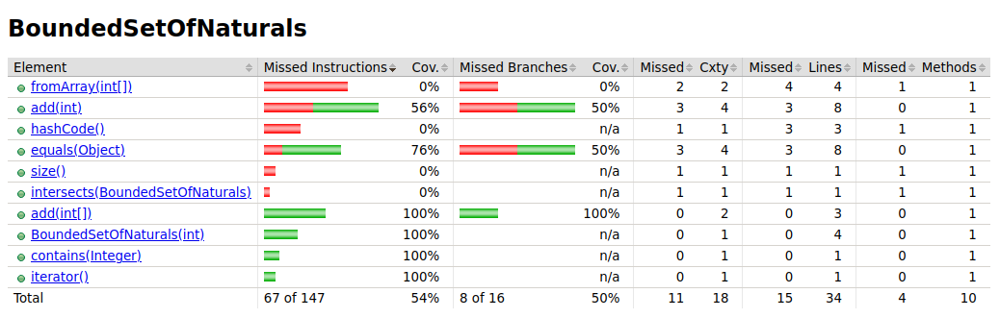
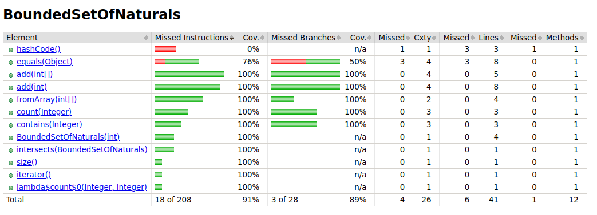

# LAB1 NOTES

## 1.1 Stack
- Comecei por implementar um código esqueleto para a Stack apenas com return null, false, 0 para todos os métodos (dummy values).
- Desenvolvi o primeiro teste até que fizesse sentido e passasse, depois desenvolvi os 3 seguintes.
- Apercebi-me da existência de dependências entre os testes, o que me fez modificar o código para que os testes fossem independentes (criei um setup inicial segundo a sugestão do professor).
- Para o último teste decidi criar um limite artifical MAX_SIZE para a stack, e implementei a verificação desse limite aquando da adição de elementos.
- A Stack ficou implementada com uma lista ligada (segui a imagem do guião), embora inicialmente estivesse a fazer com um array nativo de Object (ou seja alguns dos testes testam métodos nativos de listas ligadas em vez de ser uma implementação original).

Para testar basta estar no diretório lab1_1stack e correr `mvn test`.

## 1.2 Euromillions
- De modo a passar no teste como mencionado em `2b)`, só descomentei código no `Dip.java` talvez o professor se tenha esquecido de o retirar.
- De mencionar também que estamos neste ficheiro, o `STARS_RANGE_MAX` deveria ser 13 e não 10 (seguindo a imagem), mas deixei como estava.
- Quanto à implementação do `BoundedSetOfNaturals.java` fiz o seguinte:
    - Melhorei o método `add(int[])` para que não deixasse passar arrays demasiado grandes, podia também fazer aqui a verificação da validade de cada elemento e existência de duplicados no próprio array, mas decidi deixar isso para o método `add(int)` (embora traria atomicidade ao código).
    - Melhorei os método `count(Integer)` e `contains(Integer)` para não considerar números inválidos ou nulos no set (num set maior seria mais eficiente a exceção que analisar todo o set e verificar a não existência de um valor destes).
    - Completei o método `intersects`.
    - Quantos aos testes, decidi testar as melhorias mencionadas acima, assim como a adição de elementos e arrays sejam estes válidos ou não, esteja o set cheio ou não previamente. 

Para testar basta estar no diretório lab1_2euromillions e correr `mvn clean test jacoco:report` já que a dependência permite a visualização da cobertura dos testes a vários níveis foi adicionado ao pom.xml.

### Análise da cobertura de testes ao BoundedSetOfNaturals
- Inicialmente apenas existiam testes para adições simples e algumas delas com a lógica incorreta, por isso a cobertura era baixa como se pode ver na imagem:

- Após a adição de testes para os métodos `count`, `contains` e `intersects` e vários casos de adição a cobertura aumentou bastante, como se pode ver na imagem:

É visível que os métodos `hashCode` e `equals` não estão cobertos, já que foram gerados pelo IDE e não são utilizados no código por não fazerem parte da ideia principal do programa.