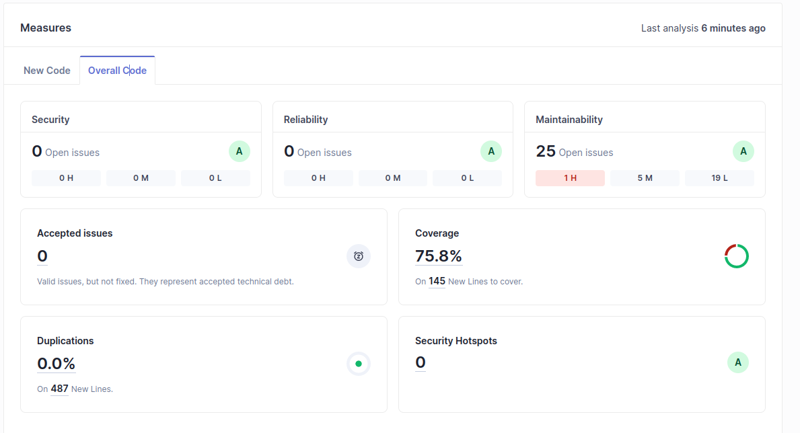
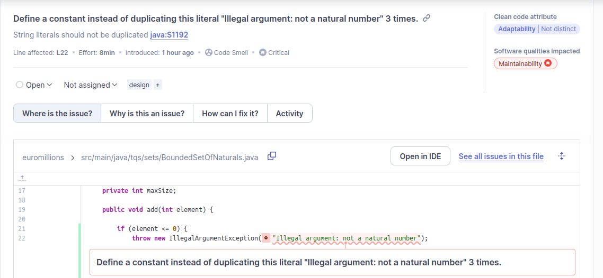
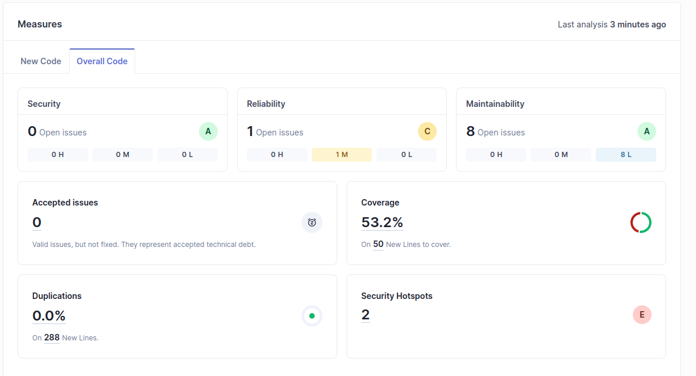
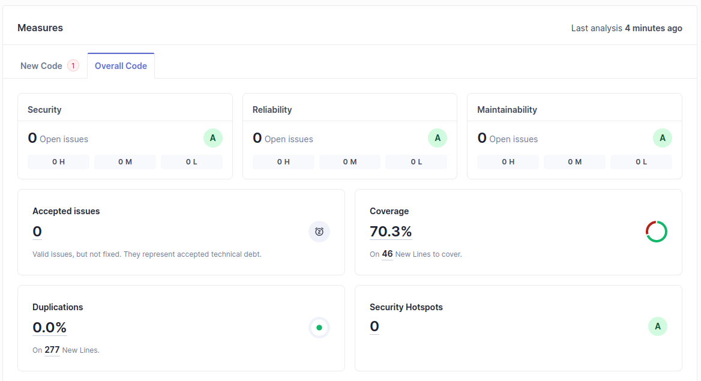

# LAB 6 NOTES

## 6.1 Euromillions
Neste projeto havia um Security Hotspot que era a utilização de `Random` para gerar números aleatórios. A solução proposta foi a utilização de `SecureRandom` que é mais seguro.

No que toca a manutenção de código, foram encontrados 25 problemas que demorariam 1h e 28m a resolver.

A destacar o Code Smell de alto impacto:

Para correr e ir ao dashboard do SonarQube, basta correr o comando `mvn clean verify sonar:sonar   -Dsonar.projectKey=euromillions   -Dsonar.projectName='euromillions'   -Dsonar.host.url=http://127.0.0.1:9000   -Dsonar.token=sqp_39da26c494f39f789dd961328ca57dfabff5a8e5` e aceder a `http://localhost:9000/`.
O token expira em 30 dias.

## 6.2 Cars Service
A technical debt correspondia a 27 minutos - demoraria a um programador cerca de 27 minutos para encontrar e corrigir os problemas encontrados pelas ferramentas de análise.

A análise do SonarQube revelou o seguinte:

Ambos os Security Hotspots devem-se a ter usado @RequestMapping ao invés de @GetMapping no CarController.java.

- Adicionei teste para o método `saveCar` 
- Tive de modificar a lógica do controlador
- Acrescentei testes para inserção de um carro inválido (que não tinha antes)

Resultados abaixo:

Para correr e ir ao dashboard do SonarQube, basta correr o comando `mvn clean verify sonar:sonar   -Dsonar.projectKey=carsservice   -Dsonar.projectName='carsservice'   -Dsonar.host.url=http://127.0.0.1:9000   -Dsonar.token=sqp_225c70f3cc776754690324f7437739b58595734d   -DskipITs=false` e aceder a `http://localhost:9000/`.
O token expira em 30 dias.

## 6.3 IES Project

//TODO 
